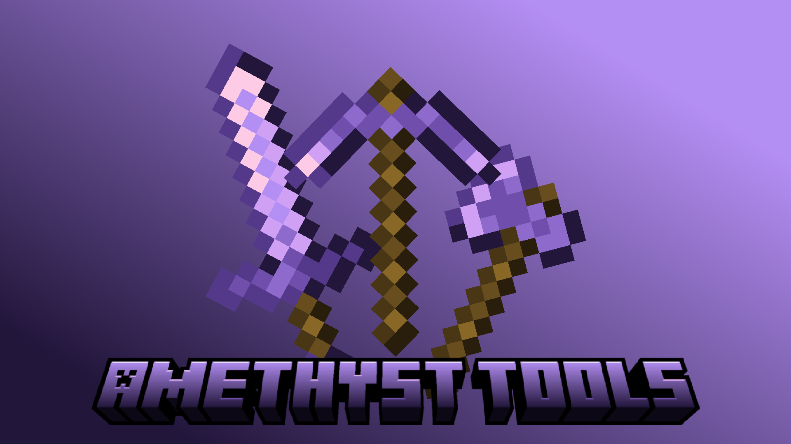
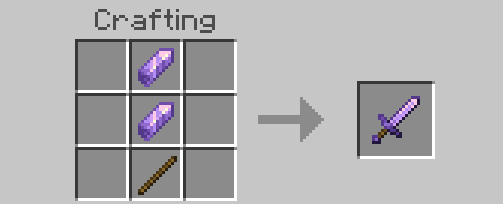
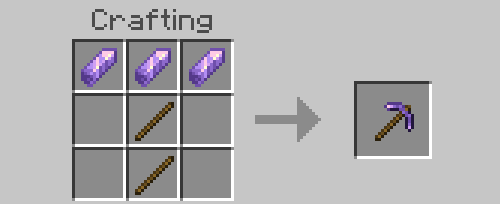
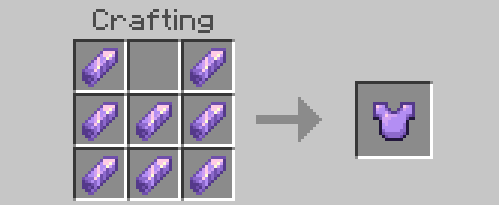
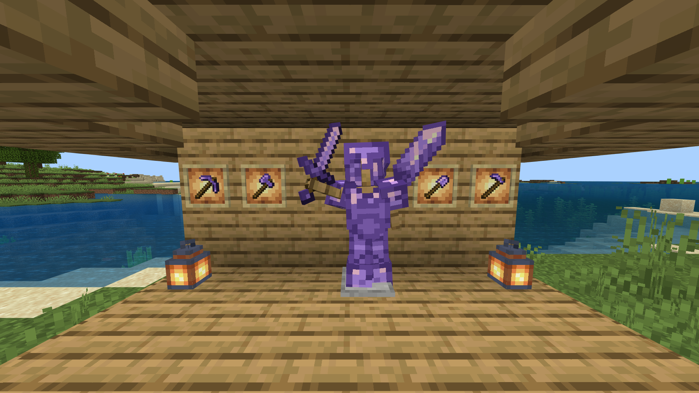
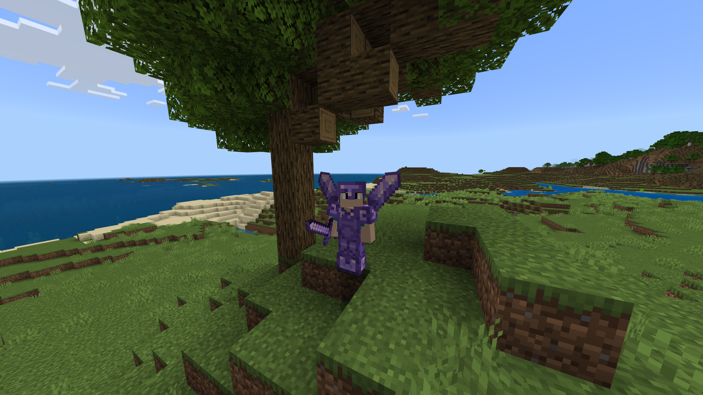

# Amethyst Tools

A set of Amethyst tools and armor.

# Overview
Amethyst tools brings a new set of tools and armor to Minecraft: Bedrock Edition. It includes axes, shovels, swords, pickaxes, hoes and armor!

# Crafting

To craft the tools/armor, you need an Amethyst Shard. You can use the crafting recipes as normal. (amethyst shards with sticks) Here are some examples: (Sword, pickaxe and chestplate)

# Screenshots (1.21.73)

# Installation

Download the following .mcaddon and install it. If you have trouble installing the addon, download and install both the Behavior and Resource packs separately.

Please do NOT redistribute the pack anywhere (including MediaFire, Linkvertise and others)
If you want to review and add a link to this addon, always link to this page.
